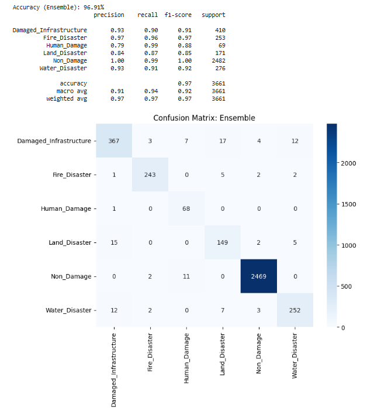
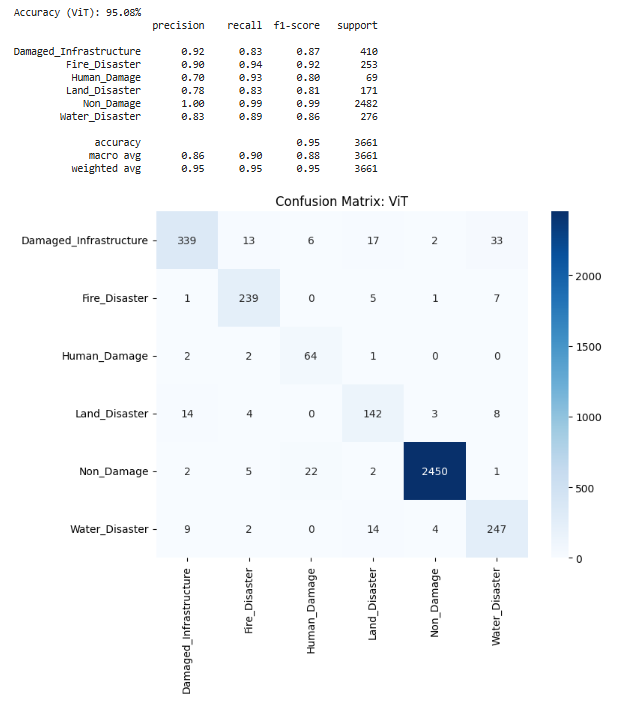

# Disaster Management & Severity Analysis System

A Deep Learning-based image classification system designed to categorize disaster scenes and assess their severity. This project utilizes state-of-the-art Convolutional Neural Networks (CNNs) and Vision Transformers (ViTs) to analyze images in real-time, providing actionable insights for disaster response and management. 

## 🚀 Features
- **Multi-Class Disaster Classification:** Identifies specific disaster types including Damaged Infrastructure, Fire Disasters, Human Damage, Land Disasters, Water Disasters, and Non-Damage (safe scenes).
- **High-Accuracy Ensemble Modeling:** Combines the predictive power of **ResNet-50** and **EfficientNet-B0** (via `timm`) with dropout regularization to achieve **96.91% accuracy**.
- **Vision Transformer Implementation:** Leverages the robust feature extraction capabilities of **ViT** (`vit_small_patch16_224`) for a secondary pipeline, achieving **95.08% accuracy**.
- **Live User Interface:** Features a fully functional **Gradio** web application for real-time inference using webcam feeds or direct image uploads.
- **Balanced Data Pipeline:** Implements dynamic class weighting (`sklearn.utils.class_weight`) and extensive data augmentation (Random Resized Crops, Horizontal Flips, Rotations, and Color Jitter) to handle dataset imbalances.

## 🛠️ Tech Stack
- **Languages:** Python
- **Deep Learning Frameworks:** PyTorch, Torchvision, TIMM (PyTorch Image Models)
- **Data Manipulation & Metrics:** NumPy, Scikit-Learn (Classification Report, Confusion Matrix)
- **Visualization:** Matplotlib, Seaborn, PIL
- **UI/Deployment:** Gradio
- **Environment:** Jupyter Notebook / Google Colab

## 📊 Dataset
The model is trained on the **Comprehensive Disaster Dataset (CDD) - Augmented**. 
* Images are resized to `224x224` and normalized using standard ImageNet parameters `([0.485, 0.456, 0.406], [0.229, 0.224, 0.225])`.
* The dataset is split into an 80% training set and a 20% validation set using PyTorch's `random_split`.

## 📈 Model Performance

Both models were trained using the `Adam` optimizer (lr=0.0001) and `CrossEntropyLoss` with balanced class weights.

| Model | Architecture | Accuracy | Highlights |
| :--- | :--- | :---: | :--- |
| **Ensemble Model** | ResNet-50 + EfficientNet-B0 | **96.91%** | Excellent precision (1.00) in filtering "Non-Damage" instances. |
| **Vision Transformer** | ViT Small (Patch 16) | **95.08%** | Highly capable baseline achieving >90% recall on Fire and Human Damage. |




## ⚙️ Installation & Setup

1. **Clone the repository:**
   ```bash
   git clone [https://github.com/yourusername/disaster-management-system.git](https://github.com/yourusername/disaster-management-system.git)
   cd disaster-management-system
